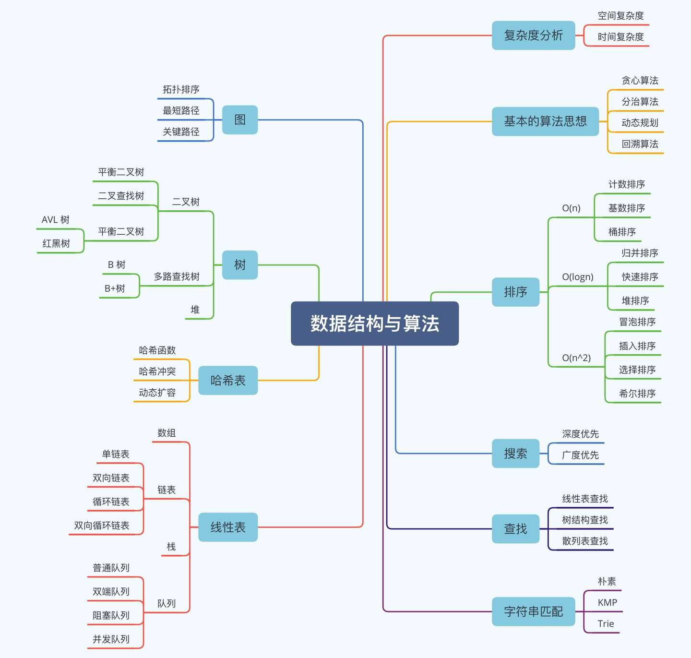
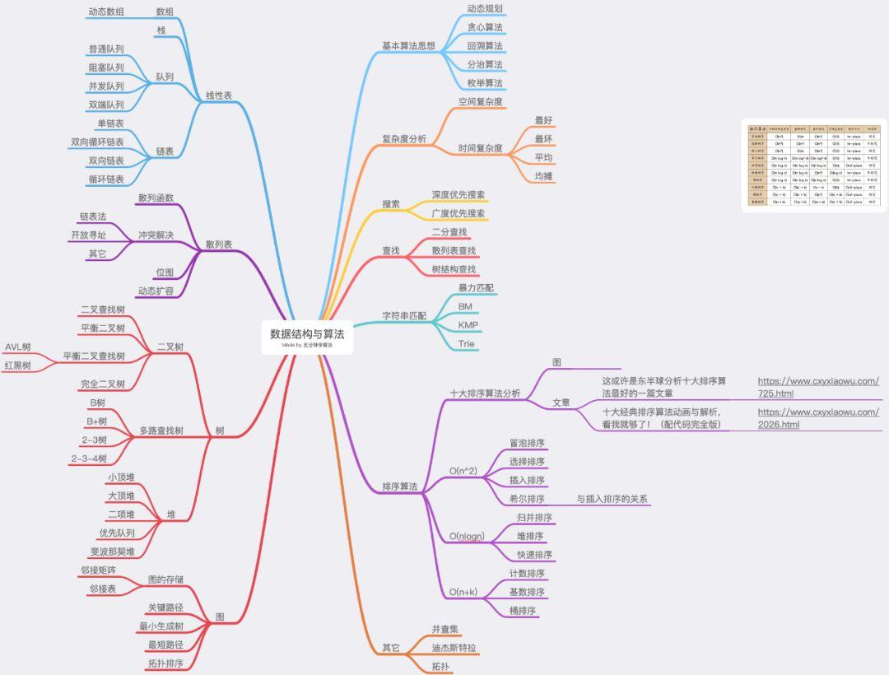

# 1 内容

-   **时间 / 空间复杂度分析**

-   数据结构
    -   数组
    -   字符串
    -   队列
    -   栈
    -   链表
    -   集合
    -   哈希表
    -   树
        -   二叉树
        -   多叉树
        -   字典树
-   算法
    -   排序
    -   双指针
    -   查找
    -   分治
    -   动态规划
    -   递归
    -   回溯
    -   贪心
    -   位运算
    -   DFS
    -   BFS
    -   图

**7 个数据结构**：

- 数组
- 链表
- 栈
- 队列
- 哈希表
- 二叉树
- 堆

**10 个算法**：

- 递归
- 排序
- 二分查找
- 搜索
- 哈希算法
- 贪心算法
- 分治算法
- 回溯算法
- 动态规划
- 字符串匹配算法

# 2 工具 
- VisuAlgo 数据结构和算法动态可视化：[https://visualgo.net/zh](https://visualgo.net/zh)
- 数据结构可视化：[https://www.cs.usfca.edu/~galles/visualization/Algorithms.html](https://www.cs.usfca.edu/~galles/visualization/Algorithms.html)

# 3 书籍

-   ⭐《小灰的漫画算法》
-   ⭐《剑指 Offer》
-   《程序员代码面试指南》
-   图解算法数据结构：[https://leetcode-cn.com/leetbook/detail/illustration-of-algorithm/](https://leetcode-cn.com/leetbook/detail/illustration-of-algorithm/)
-   LeetCode 101（C++）：[https://github.com/changgyhub/leetcode_101](https://github.com/changgyhub/leetcode_101)
-   LeetCode 题解（C++）：[https://github.com/soulmachine/leetcode](https://github.com/soulmachine/leetcode)
-   LeetCode Cookbook（Go 语言）：[https://github.com/halfrost/LeetCode-Go](https://github.com/halfrost/LeetCode-Go)
- leetbook: https://leetcode.cn/leetbook/

- 大话数据结构 [百度云下载链接](https://pan.baidu.com/s/1D_uP1IeuxfGaKU3P7L2sRQ) 密码:efr4
- 算法图解 [百度云下载链接](https://pan.baidu.com/s/1C_yeaI9RuhL7LuK2UYLx7Q) 密码:72gi

- Java数据结构和算法 [百度云下载链接](https://pan.baidu.com/s/1STqloi46Q-VgLMNDPz60lQ) 密码:4m3m

- 《数据结构与算法分析 : C 语言描述》《数据结构与算法分析 : C++描述》《数据结构与算法分析 : Java 语言描述》
- 数据结构与算法分析——Java语言描述 [百度云下载链接](https://pan.baidu.com/s/1q6brirY6gbld2KBnpLMq0g) 密码:k7qz
- 数据结构与算法 Python语言描述_裘宗燕 [百度云下载链接](https://pan.baidu.com/s/1mD2_NQtT6eVWRevuuztdyw) 密码:5r6g

- 算法（第4版） [百度云下载链接](https://pan.baidu.com/s/1LWYHUd-gybF1AMkS_exymA) 密码:1a4z
- 算法导论

我个人觉得，《算法导论》这本书的章节安排的先后顺序不是很循序渐进，里面充斥着各种算法的正确性、复杂度的证明、推导，数学公式比较多，一般人看起来都会比较吃力。

《算法》这本书也是一本经典大部头，不过它比起《算法导论》来要友好很多，更容易看懂，更适合初学者入门。但是这本书的缺点也很明显，就是内容不够全面，比如动态规划这么重要的知识点这本书就没有讲。对于数据结构的东西，它讲的也不多，基本就是偏重讲算法。

# 4 前期知识储备

https://www.code-nav.cn/rd/?rid=79550af2601114e9012110711798772b

## 4.1 帖子 
 - Leetcode刷题前应该具备哪些入门知识: https://zhuanlan.zhihu.com/p/463610723  这个好 
 - 五分钟学算法：算法与数据结构文章详细分类与整理！  https://www.cxyxiaowu.com/7072.html 这个好 
     - 数据结构如何一天速成？ https://www.cxyxiaowu.com/16383.html

### 4.1.1 解释 
https://www.iamshuaidi.com/301.html
如果你连最基本的数据结构，例如链表，队列，栈，二叉树都没有接触过，那么我是不建议你去 leetcode 刷题的，所以我上面先说了先入门一下数据结构与算法，当你学习了这些基础的数据结构之后，其实已经具备了刷题的能力了。

不过，我还是希望你能在学习一些**算法思想**，一般就这几种

1、递归
2、枚举
3、贪心
4、回溯
5、动态规划

但是，其中最重要的，我觉得就是**递归**，其他的几种算法，也都会有**递归的影子**，并且我刚才说图相关算法、二叉树的遍历等，也都包含递归的使用。

所以，在你刷题之前，或者在学习二叉树、图相关算法遇到递归的时候，我希望你能静下心来，去学一学递归，我也会告诉你，**对于初学者，递归很难**，我是被无数次折腾，无数次看答案**似懂非懂**之后，才突然醒悟了。

你不需要把它学的很精通，但是你要懂一些基本的递归题，知道递归是怎么一回事，例如最简单的**斐波那契数列**得会用递归做吧？**阶乘**也会吧（虽然不是最优解）。

所以，死磕入门数据结构，可以学习下一些算法思想，而**递归**，你必须得入门，至于动态规划、回溯，我觉得慢点学也没有，可以后面刷题遇到时在学，而枚举、贪心，相对比较简单。

关于递归的，可以看我之前的一遍入门级的文章：[为什么你学不会递归？告别递归，谈谈我的一些经验](https://mp.weixin.qq.com/s/mJ_jZZoak7uhItNgnfmZvQ)

评价还是很好，之后找些简单的题做，例如在 LintCode 那些 easy 的题（leetcode 和 lintcode 类似，类似于一个中文版，一个英文版）

## 4.2 视频课

Mit  课程  INTRODUCTION TO ALGORITHMS 
https://ocw.mit.edu/courses/6-006-introduction-to-algorithms-fall-2011/pages/readings/

Uc bakley data structures
https://inst.eecs.berkeley.edu/~cs61b/fa19/
https://people.eecs.berkeley.edu/~jrs/61b/

Introduction to Computer Systems:
https://www.cs.cmu.edu/~213/schedule.html

----

【尚硅谷】数据结构与算法（Java数据结构与算法）
https://www.bilibili.com/video/BV1E4411H73v/?vd_source=55e5cc2f534c16c73bbeb684e98c4195

内容包括: 稀疏数组、单向队列、环形队列、单向链表、双向链表、环形链表、约瑟夫问题、栈、前缀、中缀、后缀表达式、中缀表达式转换为后缀表达式、递归与回溯、迷宫问题、八皇后问题、算法的时间复杂度、冒泡排序、选择排序、插入排序、快速排序、归并排序、希尔排序、基数排序(桶排序)、堆排序、排序速度分析、二分查找、插值查找、斐波那契查找、散列、哈希表、二叉树、二叉树与数组转换、二叉排序树(BST)等。

P16~P23 单链表  
P24~P26 双向链表  

P27~P29 约瑟夫环  
P30~P35 栈·栈实现计算器  
P36~P42 前缀，中缀，后缀表达式，逆波兰计算器的实现  
P43~P49 递归，迷宫回溯，八皇后  

P50~P53 排序算法基础  
* 54~56 冒泡排序  
* 57~59 选择排序  
* 60~62 插入排序  
* 63~65 希尔排序  
* 66~68 快速排序  
* 69~71 归并排序  
* 72~75 基数排序  
* 76各种排序的比较  

127~131 二叉排序树  
132~134 BST删除一棵子树的节点  
135 二叉平衡树  

146~151 图，图的深度优先和广度优先  
156~159 动态规划  
160~163 暴力匹配和KMP算法  
164~ 167 贪心算法

## 4.3 时间空间复杂度

小学生也能看懂的时间复杂度（大概吧）
https://www.bilibili.com/video/BV1nE411x7qP/?from=search&seid=3250974645541167987&spm_id_from=333.337.0.0&vd_source=55e5cc2f534c16c73bbeb684e98c4195

数据结构-时间复杂度的计算方法
https://www.bilibili.com/video/BV1mV411i7U3/?spm_id_from=333.788.recommend_more_video.3&vd_source=55e5cc2f534c16c73bbeb684e98c4195

两种套路搞定所有时间复杂度408真题 (这个好)
https://www.bilibili.com/video/BV1M1421R7nX/?spm_id_from=333.788.recommend_more_video.-1&vd_source=55e5cc2f534c16c73bbeb684e98c4195

pdf: what's big notation 
https://web.mit.edu/16.070/www/lecture/big_o.pdf

考研数据结构之时间复杂度（含递归) (这好)
https://www.bilibili.com/video/BV1Jh4y1k7Bh/?spm_id_from=333.788.recommend_more_video.8&vd_source=55e5cc2f534c16c73bbeb684e98c4195

# 5 Leetcode 

数组-> 链表-> 哈希表->字符串->栈与队列->树->回溯->贪心->动态规划->图论->高级数据结构，

## 5.1 Leetcode刷题指南 

-   LeetCode 精选 100 道：[https://leetcode-cn.com/problem-list/2cktkvj/](https://leetcode-cn.com/problem-list/2cktkvj/)
-   LeetCode 精选算法 200 题：[https://leetcode-cn.com/problem-list/qg88wci/](https://leetcode-cn.com/problem-list/qg88wci/)
- LeetCode 高频题！ https://www.algomooc.com/1659.html
- leetcode 题解  https://github.com/jiangshanmeta/meta/blob/master/README.md  大多数都是靠 javascript 和 typescript 写的 我就不看了 
- LeetCode 刷题攻略  https://github.com/youngyangyang04/leetcode-master/?tab=readme-ov-file   这个好 
- Leetcode面试高频题分类刷题总结 https://zhuanlan.zhihu.com/p/349940945   这个好   经典三百题
- youngyangyang04/leetcode-master  https://github.com/youngyangyang04/leetcode-master/  这个好 

花花酱 LeetCode 题目分类 | youtube.com/user/xxfflower   非常有用 
https://docs.google.com/spreadsheets/d/1yRCOJ8KysRVkq0O9IlDriT01tC6lzPapmFO4PCmDJQA/edit?gid=1674276502#gid=1674276502

![[01_总览/image/algorithm-c4d31ba3-6d81-4617-a68b-81d935b2a106.png]]

## 5.2 视频课 

- Leetcode 真题解析：[https://www.bilibili.com/video/BV1a54y1b74k](https://www.bilibili.com/video/BV1a54y1b74k)
- 花花酱的表世界  https://space.bilibili.com/9880352?spm_id_from=333.788.b_765f7570696e666f.1
    - https://www.youtube.com/user/xxfflower/featured
- Huifeng Guan  https://www.youtube.com/channel/UCY5Z0of98W-YSdmPgAe1DaA
- basketwangCoding https://www.youtube.com/channel/UCE35PnPX7EZi8nHSegjMn6Q/videos
- 全英文的： https://www.youtube.com/channel/UCmJz2DV1a3yfgrR7GqRtUUA
